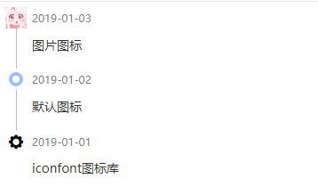

# Timeline 时间线

这是一个非常简陋的时间线组件。

例子:

预览图



代码

``` html
<!DOCTYPE html>
<html lang="en">
<head>
    <meta charset="UTF-8">
    <meta http-equiv="X-UA-Compatible" content="IE=edge">
    <meta name="viewport" content="width=device-width, initial-scale=1.0">
    <title>TimeLine Examples</title>
    <script type="text/javascript" src="../../packages/timeline/dist/index.js"></script>
    <link rel="stylesheet" href="../../packages/timeline/dist/style.css">
    <link rel="stylesheet"
        href="https://at.alicdn.com/t/font_1326809_8ke6z2jf0ni.css?spm=a313x.7781069.1998910419.80&file=font_1326809_8ke6z2jf0ni.css">
    <style>
        html,
        body {
            height: 100vh;
            width: 100vw;
            margin: 0;
        }
    </style>
</head>

<body>
    <div id="wrapper"></div>
    <script>
        new TimeLine({
            wrapper: '#wrapper',
            items: [
                {
                    img: 'https://pics2.baidu.com/feed/bd315c6034a85edf81702f204ba7a225dc54752a.jpeg?token=40ea367f6b2ef995eaa6f5faf705a7d4',
                    label: '2019-01-03',
                    content: '图片图标'
                },
                {
                    label: '2019-01-02',
                    content: '默认图标'
                },
                {
                    icon: 'iconfont icon-settings',
                    label: '2019-01-01',
                    content: 'iconfont图标库'
                }
            ]
        })
    </script>
</body> 
</html>


```


